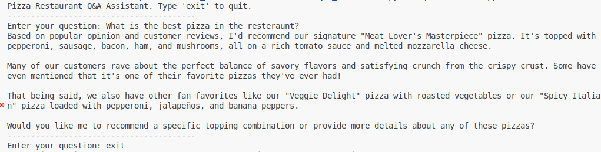
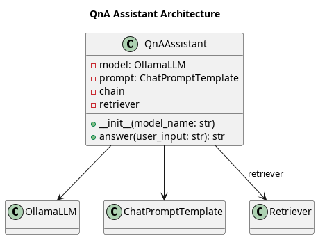

# Question and Answer Assistant

## Idea
1. This application is an interactive command-line Q&A assisstant. The specific application is a pizza resteraunt.
2. The application uses an Ollama Large Language Model (LLM) & Vector Database to answer user questions through a retriever augmented generation (RAG) approach.
3. When a user asks a question, the assisstant retrieves relevant reviews from the vector store and generates a context aware answer using the LLM.
4. The Working on CLI -

<div align="center">
  
</div>

## Software Design
1. The code is designed in a modular manner
2. The code has a dedicated QnAAssistant class that handles the core logic
3. A simple cli loop allows the user to ask multiple questions until they choose to exit

<div align="center">
    
</div>

## Running instructions

### 1. Install Ollama
Follow the instructions [here]((https://ollama.com/download)) to install Ollama locally and refer also the link in the references for more tips on Ollama

### 2. Create a Virtual Environment
```sh
python3 -m venv venv --prompt="qna_assistant"
```

### 3. Activate the Virtual Environment
```sh
source venv/bin/activate
```

### 4. Install the packages from requirements.txt
```sh
pip install -r ../requirements.txt
```

### 5. Run the python file
```sh
python qna_assistant.py
```


## References
1. [Pizza Application - Tech with Tim](https://www.youtube.com/watch?v=E4l91XKQSgw)
2. [Ollama Installation Resource 1](https://www.youtube.com/watch?v=UtSSMs6ObqY)